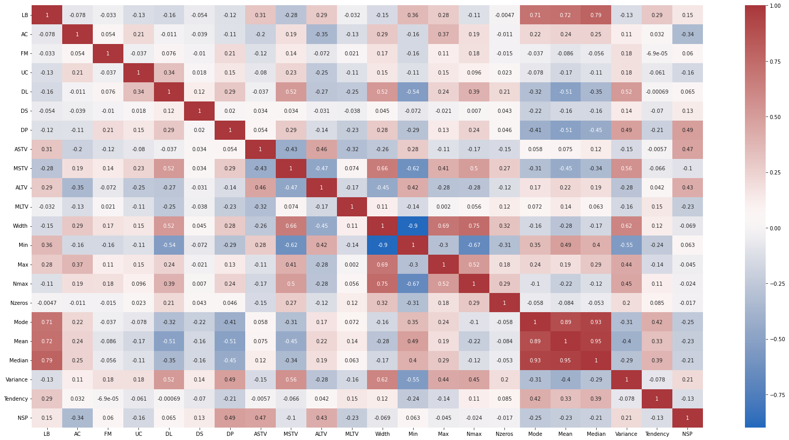
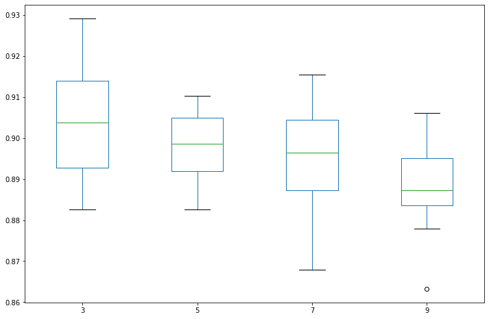
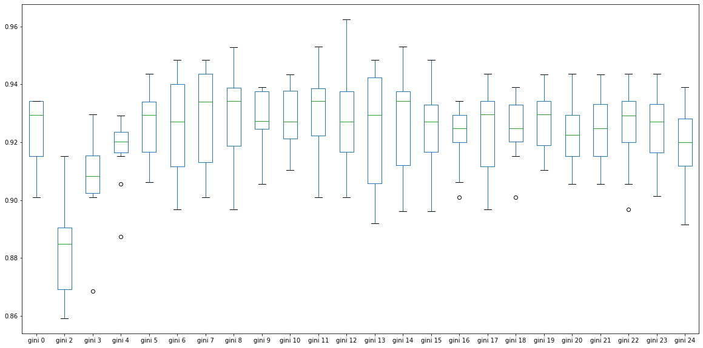
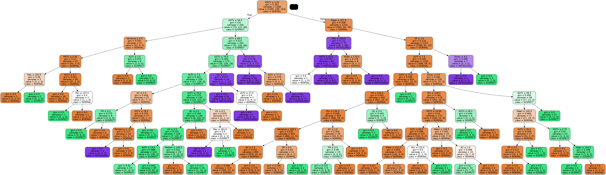
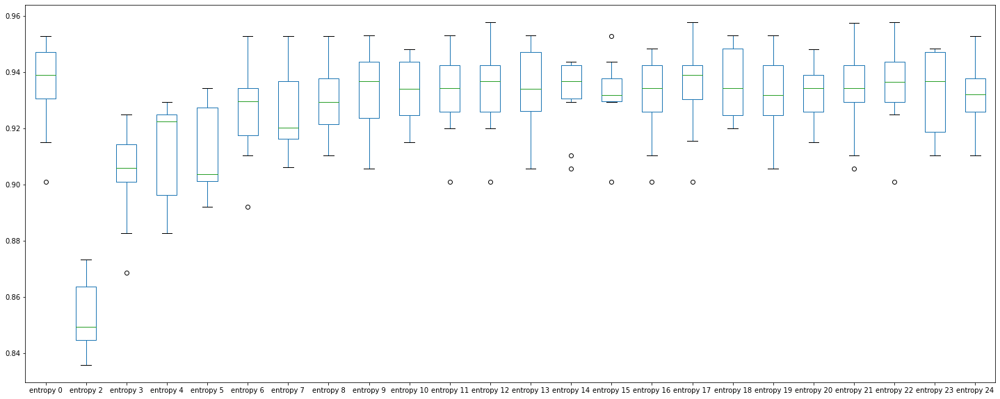
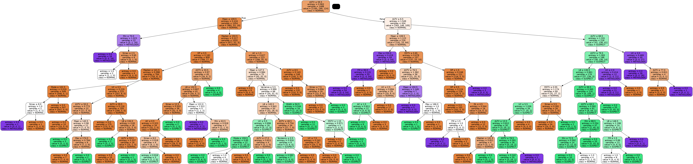

```python
!pip install xlrd pandas seaborn matplotlib sklearn seaborn xlrd
```

    Requirement already satisfied: xlrd in ./.venv/lib/python3.8/site-packages (2.0.1)
    Requirement already satisfied: pandas in ./.venv/lib/python3.8/site-packages (1.3.5)
    Requirement already satisfied: seaborn in ./.venv/lib/python3.8/site-packages (0.11.2)
    Requirement already satisfied: matplotlib in ./.venv/lib/python3.8/site-packages (3.5.1)
    Requirement already satisfied: sklearn in ./.venv/lib/python3.8/site-packages (0.0)
    Requirement already satisfied: pytz>=2017.3 in ./.venv/lib/python3.8/site-packages (from pandas) (2021.3)
    Requirement already satisfied: numpy>=1.17.3; platform_machine != "aarch64" and platform_machine != "arm64" and python_version < "3.10" in ./.venv/lib/python3.8/site-packages (from pandas) (1.21.4)
    Requirement already satisfied: python-dateutil>=2.7.3 in ./.venv/lib/python3.8/site-packages (from pandas) (2.8.2)
    Requirement already satisfied: scipy>=1.0 in ./.venv/lib/python3.8/site-packages (from seaborn) (1.7.3)
    Requirement already satisfied: pyparsing>=2.2.1 in ./.venv/lib/python3.8/site-packages (from matplotlib) (3.0.6)
    Requirement already satisfied: pillow>=6.2.0 in ./.venv/lib/python3.8/site-packages (from matplotlib) (8.4.0)
    Requirement already satisfied: cycler>=0.10 in ./.venv/lib/python3.8/site-packages (from matplotlib) (0.11.0)
    Requirement already satisfied: fonttools>=4.22.0 in ./.venv/lib/python3.8/site-packages (from matplotlib) (4.28.3)
    Requirement already satisfied: kiwisolver>=1.0.1 in ./.venv/lib/python3.8/site-packages (from matplotlib) (1.3.2)
    Requirement already satisfied: packaging>=20.0 in ./.venv/lib/python3.8/site-packages (from matplotlib) (21.3)
    Requirement already satisfied: scikit-learn in ./.venv/lib/python3.8/site-packages (from sklearn) (1.0.1)
    Requirement already satisfied: six>=1.5 in ./.venv/lib/python3.8/site-packages (from python-dateutil>=2.7.3->pandas) (1.16.0)
    Requirement already satisfied: threadpoolctl>=2.0.0 in ./.venv/lib/python3.8/site-packages (from scikit-learn->sklearn) (3.0.0)
    Requirement already satisfied: joblib>=0.11 in ./.venv/lib/python3.8/site-packages (from scikit-learn->sklearn) (1.1.0)


# Exames cardiotopagico
[Referencia]("https://blog.medicalway.com.br/cardiotocografia-entenda-a-importancia-para-a-saude-do-bebe/")

A cardiotocografia (CTG) é um exame que registra da atividade cardíaca do bebe, observa as contrações uterinas e os movimentos fetais.  
  
A interpretação do exame é realizada por meio de uma análise do traçado resultante da atividade cardíaca fetal e de sua variabilidade — ou seja, espera-se que a frequência cardíaca fetal varie junto com movimentos e contrações uterinas. Os padrões esperados de variabilidade são bem documentados e, assim, detectam as alterações com mais facilidade.  

A CTG é um exame prático — pois não precisa da presença do operador ao lado da gestante —, relativamente barato e que traz resultados bastante confiáveis.  

O exame de CTG é comumente solicitado no final da gravidez, após 38 semanas em gestações que transcorrem normalmente, durante o trabalho de parto ou a qualquer momento (em gestações acima de 30 semanas), desde que haja necessidade de avaliar a vitalidade fetal.  

A cardiotocografia (CTG) é fundamental para garantir que a gestação transcorre bem nas últimas semanas. Isso porque o resultado do exame, quando mostra algum desvio, pode indicar insuficiência na oxigenação cerebral do bebê. Essa deficiência pode ser causada por vários fatores, como:

1. posição do feto;
2. problemas na placenta;
3. cordão umbilical enrolado no pescoço do bebê.

# Quais sinais indicam sofrimento fetal?
A cardiotocografia pode detectar sinais de sofrimento fetal. São eles:

1. FCF (Frequência Cardíaca Fetal) acima de 160 batimentos por minuto, que permanece assim, indica taquicardia fetal;
2. FCF abaixo de 110 batimentos por minuto indica bradicardia fetal;
3. o normal é que a FCF varie de acordo com os movimentos dos bebês ou quando ele escuta um barulho alto. Caso essa frequência permaneça constante ela indica sofrimento fetal;
4. quedas significativas na FCF demonstram desacelerações na frequência cardíaca do bebê;
5. desacelerações na FCF após as contrações podem indicar que o oxigênio do feto está diminuindo.


```python
import pandas as pd
import numpy as np
df = pd.read_excel('./CTG.xls',sheet_name='Raw Data',header=0).drop(index=[0,2127,2128,2129]).drop(labels=["FileName","SegFile","Date"],axis=1)
```

## Análise exploratória 

Primeira etapa é verificar o percentual de nulos existentes no Dataframe, visto que não podemos aplicar um algoritmo em dados nulos, temos que fazer essa limpeza, esse processo é conhecido como data cleaning.  
Se o percentual de nulos for muito alto devemos descartar a feature, porém caso seja baixo o percentual podemos apenas eliminar algumas linhas.


```python
#colunas = ['A', 'B', 'C', 'D', 'E', 'AD', 'DE', 'LD', 'FS', 'SUSP', 'CLASS','NSP']
colunas_2= ['LB','AC','FM','UC','DL','DS','DP','ASTV','MSTV','ALTV','MLTV','Width','Min','Max','Nmax','Nzeros','Mode','Mean','Median','Variance','Tendency','NSP']
df = df[colunas_2]

#Para cada coluna em df calcule  o % de nulos.
[ (i, f"{(df[i]==np.nan).mean()*100}%") for i in df]
```


    [('LB', '0.0%'),
     ('AC', '0.0%'),
     ('FM', '0.0%'),
     ('UC', '0.0%'),
     ('DL', '0.0%'),
     ('DS', '0.0%'),
     ('DP', '0.0%'),
     ('ASTV', '0.0%'),
     ('MSTV', '0.0%'),
     ('ALTV', '0.0%'),
     ('MLTV', '0.0%'),
     ('Width', '0.0%'),
     ('Min', '0.0%'),
     ('Max', '0.0%'),
     ('Nmax', '0.0%'),
     ('Nzeros', '0.0%'),
     ('Mode', '0.0%'),
     ('Mean', '0.0%'),
     ('Median', '0.0%'),
     ('Variance', '0.0%'),
     ('Tendency', '0.0%'),
     ('NSP', '0.0%')]


Como estamos com um dataframe já preparado não haverá necessidade de data cleaning.

A segunda etapa é um processo de feature engineer escolher as melhores features para criar o modelo de machine learning.  
  
Para isso vamos falar um pouco sobre correlação.  
A correlação é a medida de ligação entre duas característcas, exemplo 
```
Uma pizzaria faz 120 pizzas por hora com 3 fornos e 10 funcionários.
Se um forno quebra, há uma redução na produção de pizzas para 80 pizzas por hora.
Com os 3 fornos funcionando perfeitamente com apenas 5 funcionários a produção de pizzas reduz para 100 pizzas por hora.
Temos então um alta correlação entre pizzas por hora e quantidade de fornos, porém uma correlação mais baixa entre número de funcionários e pizzas por hora.
```

A correlação de spearman serve para dados que não estão dentro de uma distribuição de dados normal, por isso é melhor indicada se não sabe-se como os dados evoluem.


```python
import seaborn as sns
import matplotlib.pyplot as plt

df_corr =df
fig, ax = plt.subplots(figsize=(29, 15))
sns.color_palette("vlag", as_cmap=True)
sns.heatmap(df_corr.corr(),annot=True,cmap='vlag')
```


    <AxesSubplot:>


    

    


Observando a linha do nosso target NSP na última linha do heatmap, as features LD, FS, SUSP e CLASS tem maior correalçao positiva.  
Enquanto A,B e AD maior correlação negativa, em outras palavras inversamente proporcional.  
``` A correlação de C e D impactam pouco no target poderiamos retirar-las.```

## Divisão


```python
#features = ['A', 'B', 'C', 'D', 'E', 'AD', 'DE', 'LD', 'FS', 'SUSP', 'CLASS']
X = df.drop('NSP',axis=1)#[features]
y = df['NSP']
```

## KNN 
[Referencia kfold]("https://scikit-learn.org/stable/modules/generated/sklearn.model_selection.KFold.html?highlight=k%20fold#sklearn.model_selection.KFold.split")  
[Como usar o kfold]("https://drigols.medium.com/introdu%C3%A7%C3%A3o-a-valida%C3%A7%C3%A3o-cruzada-k-fold-2a6bced32a90")


```python
from sklearn.model_selection import KFold
from sklearn.neighbors import KNeighborsClassifier
from sklearn.model_selection import cross_val_score 

knn = pd.DataFrame()
```


```python
split = 10
```


```python
knn3 =  KNeighborsClassifier(n_neighbors=3)
kfold  = KFold(n_splits=split, shuffle=True,random_state=1)
knn[3] = cross_val_score(knn3, X, y, cv = kfold) 

```


```python
knn5 =  KNeighborsClassifier(n_neighbors=5)
kfold  = KFold(n_splits=split, shuffle=True,random_state=1)
knn[5] = cross_val_score(knn5, X, y, cv = kfold) 
```


```python
knn7 = KNeighborsClassifier(n_neighbors=7)
kfold  = KFold(n_splits=split, shuffle=True,random_state=1)
knn[7] = cross_val_score(knn7, X, y, cv = kfold) 

```


```python
knn9 =  KNeighborsClassifier(n_neighbors=9)
kfold  = KFold(n_splits=split, shuffle=True,random_state=1)
knn[9] = cross_val_score(knn9, X, y, cv = kfold) 

```


```python
knn.boxplot(figsize=(12,8),grid=False)
```


    <AxesSubplot:>


    

    


```python
knn.describe()
```


<div>
<style scoped>
    .dataframe tbody tr th:only-of-type {
        vertical-align: middle;
    }

    .dataframe tbody tr th {
        vertical-align: top;
    }

    .dataframe thead th {
        text-align: right;
    }
</style>
<table border="1" class="dataframe">
  <thead>
    <tr style="text-align: right;">
      <th></th>
      <th>3</th>
      <th>5</th>
      <th>7</th>
      <th>9</th>
    </tr>
  </thead>
  <tbody>
    <tr>
      <th>count</th>
      <td>10.000000</td>
      <td>10.000000</td>
      <td>10.000000</td>
      <td>10.000000</td>
    </tr>
    <tr>
      <th>mean</th>
      <td>0.904050</td>
      <td>0.897462</td>
      <td>0.895106</td>
      <td>0.888050</td>
    </tr>
    <tr>
      <th>std</th>
      <td>0.014375</td>
      <td>0.009058</td>
      <td>0.013524</td>
      <td>0.012139</td>
    </tr>
    <tr>
      <th>min</th>
      <td>0.882629</td>
      <td>0.882629</td>
      <td>0.867925</td>
      <td>0.863208</td>
    </tr>
    <tr>
      <th>25%</th>
      <td>0.892810</td>
      <td>0.892019</td>
      <td>0.887324</td>
      <td>0.883670</td>
    </tr>
    <tr>
      <th>50%</th>
      <td>0.903756</td>
      <td>0.898585</td>
      <td>0.896481</td>
      <td>0.887324</td>
    </tr>
    <tr>
      <th>75%</th>
      <td>0.914020</td>
      <td>0.904930</td>
      <td>0.904481</td>
      <td>0.895175</td>
    </tr>
    <tr>
      <th>max</th>
      <td>0.929245</td>
      <td>0.910377</td>
      <td>0.915493</td>
      <td>0.906103</td>
    </tr>
  </tbody>
</table>
</div>


## Árvore de decisão
[Referência]("https://scikit-learn.org/stable/modules/generated/sklearn.tree.DecisionTreeClassifier.html?highlight=decision%20tree#sklearn.tree.DecisionTreeClassifier")  
  
Por padrão a árvore de decisão é configurada para ter profundidade máxima,caso não especifique o ```max_depth```, isso é um problema.  
Ao entrar um dado completamente novo a árvore terá dificuldade em classificar, pois com uma profundidade muito grande o modelo tende ao overfit decorar os dados.  
Em contrapartida ao overfit temos o underfit que é um modelo muito 'fraco' que não consegue 'acertar' muito bem o resultado.  
Sendo assim definimos um tamanho considerável e fazemos os testes, esse processo se chama tunagem de hyperparametros, a escolha de configuração que gera o melhor modelo.

### Gini


```python
from sklearn.tree import DecisionTreeClassifier
from sklearn.model_selection import KFold
```


```python
gini = pd.DataFrame()
split = 10
deph = range(2,25)

tree = DecisionTreeClassifier()
kfold  = KFold(n_splits = split, shuffle=True,random_state=1)
gini[f"gini 0"] = cross_val_score(tree, X, y, cv = kfold) 
for d in deph:
    tree = DecisionTreeClassifier(max_depth=d)
    kfold  = KFold(n_splits = split, shuffle=True,random_state=1)
    gini[f"gini {d}"] = cross_val_score(tree, X, y, cv = kfold) 
gini.boxplot(figsize=(20,10),grid=False)

```


    <AxesSubplot:>


    

    


```python
gini.median(axis=0).sort_values(ascending=False)[:10]
```


    gini 8     0.938823
    gini 10    0.936321
    gini 9     0.931604
    gini 7     0.931604
    gini 13    0.929577
    gini 6     0.929577
    gini 18    0.929411
    gini 0     0.929411
    gini 5     0.929411
    gini 21    0.929245
    dtype: float64


```python
gini.std().sort_values(ascending=True)[:10]
```


    gini 9     0.011318
    gini 5     0.011495
    gini 15    0.011737
    gini 16    0.012828
    gini 11    0.012985
    gini 18    0.013228
    gini 4     0.014026
    gini 21    0.014174
    gini 10    0.014547
    gini 14    0.014696
    dtype: float64


### Árvore 


```python
from sklearn.model_selection import train_test_split
from sklearn.tree import export_graphviz
from six import StringIO
from IPython.display import Image  
import pydotplus

tree = DecisionTreeClassifier(max_depth = 9)
X_train, X_test, y_train, y_test = train_test_split(X,y,train_size=0.7,random_state=1)
tree.fit(X_train,y_train)

target_names  = ['NORMAL', 'SUSPECT', 'PATHOLOGIC']

dot_data = StringIO()

export_graphviz(tree, out_file=dot_data,  
                filled=True,
                rounded=True,
                special_characters=True,
                feature_names = X.columns,
                class_names  = target_names)

graph = pydotplus.graph_from_dot_data(dot_data.getvalue())

#graph.write_png('iris.png')
Image(graph.create_png())

```


    

    


Aparentemente a melhor escolha de profundidade com criterio gini é 9 por ter uma das maiores medianas e desvio padrão baixo.


### Entropy


```python
entropy = pd.DataFrame()
split = 10
deph = range(2,25)

tree = DecisionTreeClassifier(criterion="entropy")
kfold  = KFold(n_splits = split, shuffle=True,random_state=1)
entropy[f"entropy 0"] = cross_val_score(tree, X, y, cv = kfold) 
for d in deph:
    tree = DecisionTreeClassifier(criterion="entropy",max_depth=d)
    kfold  = KFold(n_splits = split, shuffle=True,random_state=1)
    entropy[f"entropy {d}"] = cross_val_score(tree, X, y, cv = kfold) 
entropy.boxplot(figsize=(25,10),grid=False)
```


    <AxesSubplot:>


    

    


```python
entropy.median(axis=0).sort_values(ascending=False)[:10]
```


    entropy 0     0.938967
    entropy 17    0.938967
    entropy 14    0.936620
    entropy 23    0.936620
    entropy 9     0.936620
    entropy 12    0.936620
    entropy 22    0.936465
    entropy 21    0.934272
    entropy 11    0.934272
    entropy 20    0.934272
    dtype: float64


```python
gini.std().sort_values(ascending=True)[:10]
```


    gini 9     0.011318
    gini 5     0.011495
    gini 15    0.011737
    gini 16    0.012828
    gini 11    0.012985
    gini 18    0.013228
    gini 4     0.014026
    gini 21    0.014174
    gini 10    0.014547
    gini 14    0.014696
    dtype: float64


A profundidade 9 tem o menor desvio padrão e 5 maior mediana parece ser o melhor nivel a se escolher para o critério de entropia.

### Árvore


```python
from sklearn.model_selection import train_test_split
from sklearn.tree import export_graphviz
from six import StringIO
from IPython.display import Image  
import pydotplus

tree = DecisionTreeClassifier(criterion="entropy",max_depth = 9)
X_train, X_test, y_train, y_test = train_test_split(X,y,train_size=0.7,random_state=1)
tree.fit(X_train,y_train)

target_names  = ['NORMAL', 'SUSPECT', 'PATHOLOGIC']

dot_data = StringIO()

export_graphviz(tree, out_file=dot_data,  
                filled=True,
                rounded=True,
                special_characters=True,
                feature_names = X.columns,
                class_names  = target_names)

graph = pydotplus.graph_from_dot_data(dot_data.getvalue())
Image(graph.create_png())

```


    

    


## SVM (Em breve)

